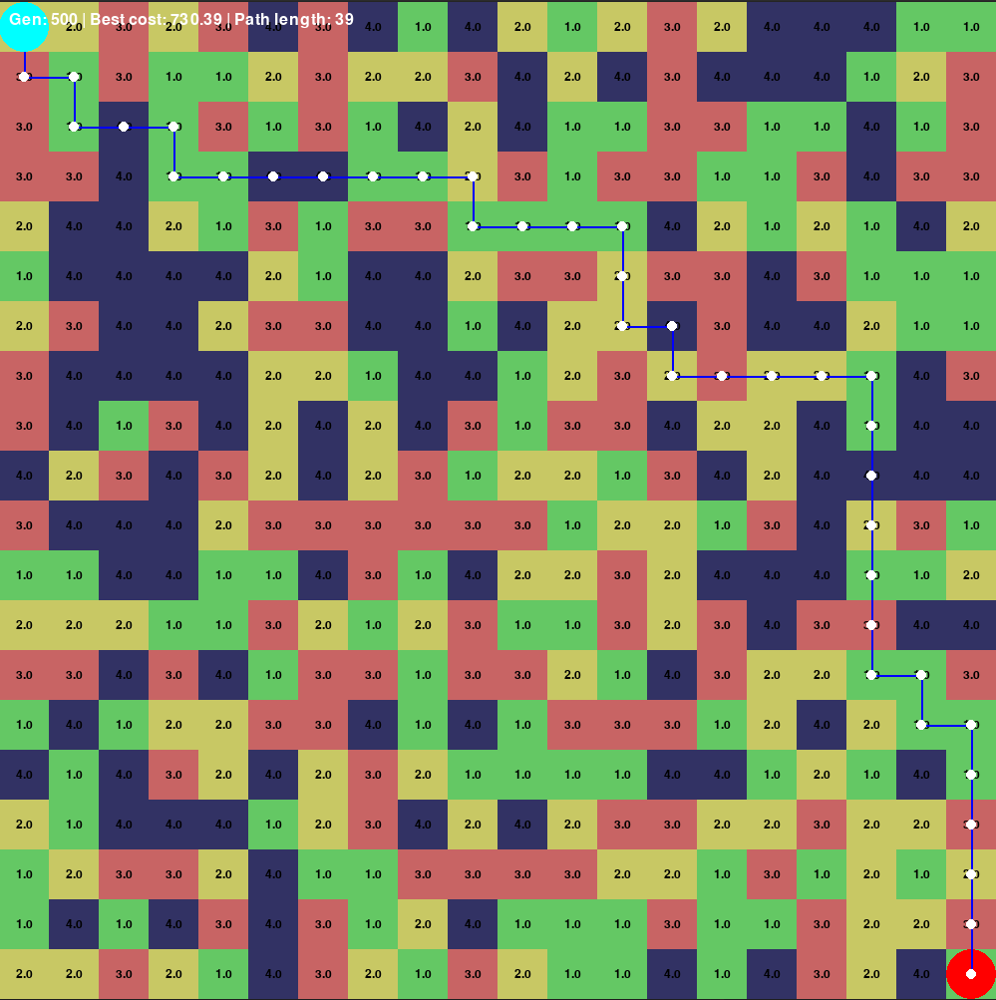

# GA Robot: Genetic Algorithm Path Planning

This project demonstrates a genetic algorithm-based approach to plan an optimal path for a robot navigating a grid-based map. The algorithm evolves candidate paths to find one that minimizes the total traversal cost while ensuring that each step is adjacent and valid within the grid.

## Features

- **Random Map Generation:**  
  Generates a grid map where each tile is randomly assigned one of four surface types (A, B, C, D), each with a different traversal cost.

- **Genetic Algorithm (GA):**  
  - **Population Initialization:** Starts with a population of random paths from the start cell to the goal cell.
  - **Fitness Evaluation:** Each path is evaluated based on:
    - The total surface cost (weighted by the cost of traversing each tile).
    - A penalty for non-adjacent moves (to enforce valid steps).
    - A length penalty.
    - A distance penalty based on the Manhattan distance from the last cell to the goal (if not reached).
  - **Operators:** Implements selection, crossover, and mutation operators to evolve the population over generations.
  - **Elitism:** Preserves the best candidate paths across generations.

- **Visualization with Pygame:**  
  - Displays the grid map with cost values for each tile.
  - Draws the best path found by the GA using connecting lines and dots.
  - Highlights the start and goal cells.

## Requirements

- Python 3.x
- Pygame  
  Install via pip:
  ```bash
  pip install pygame
## How to Run

### Clone the Repository:
```bash
git clone https://github.com/phule1812/ga-robot.git
cd ga-robot
```

### Run the project
```bash
python ggen_path.py
```

### Observe the Result:
A Pygame window will open displaying:

The randomly generated map with surface costs.
The best path found by the GA (shown as lines and dots).
On-screen information including the current generation, best cost, and the path length.



## Customization
### Map Parameters:
Adjust WIDTH, HEIGHT, and TILE_SIZE in the code to change the grid dimensions.

### GA Parameters:
Experiment with POPULATION_SIZE, MAX_GENERATIONS, MUTATION_RATE, CROSSOVER_RATE, and MAX_PATH_LENGTH to improve performance or behavior of the GA.

### Cost Function:
Modify SURFACE_WEIGHT, DISTANCE_FACTOR, and LENGTH_PENALTY to balance between minimizing energy consumption and ensuring valid, adjacent steps.
